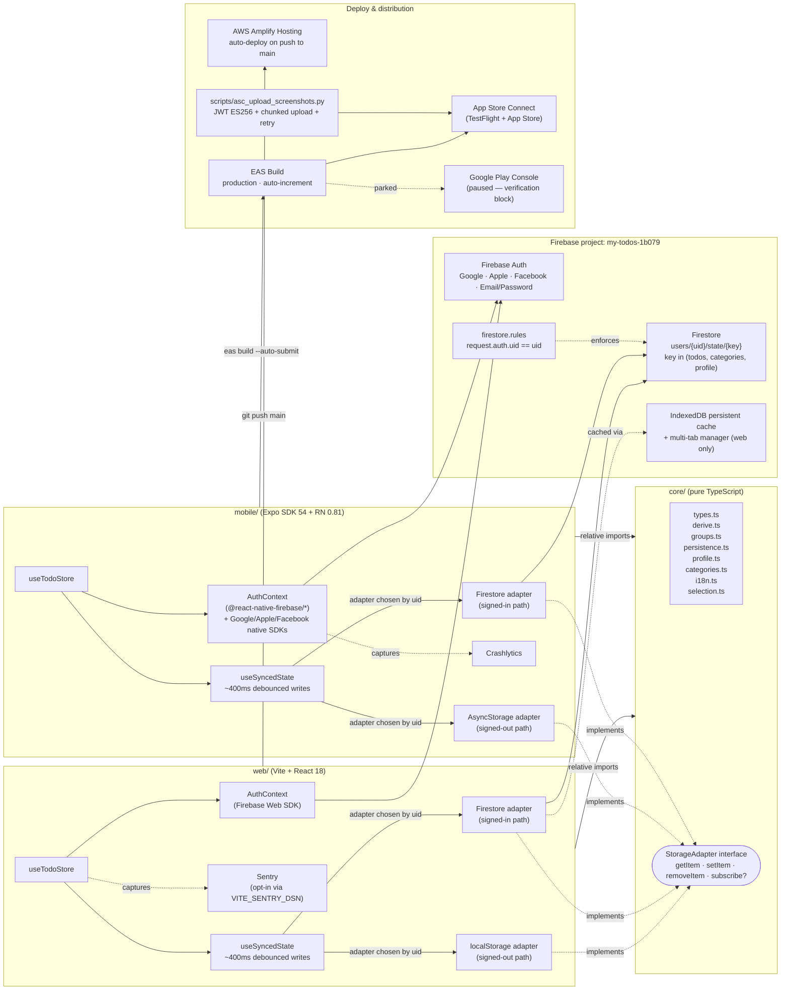
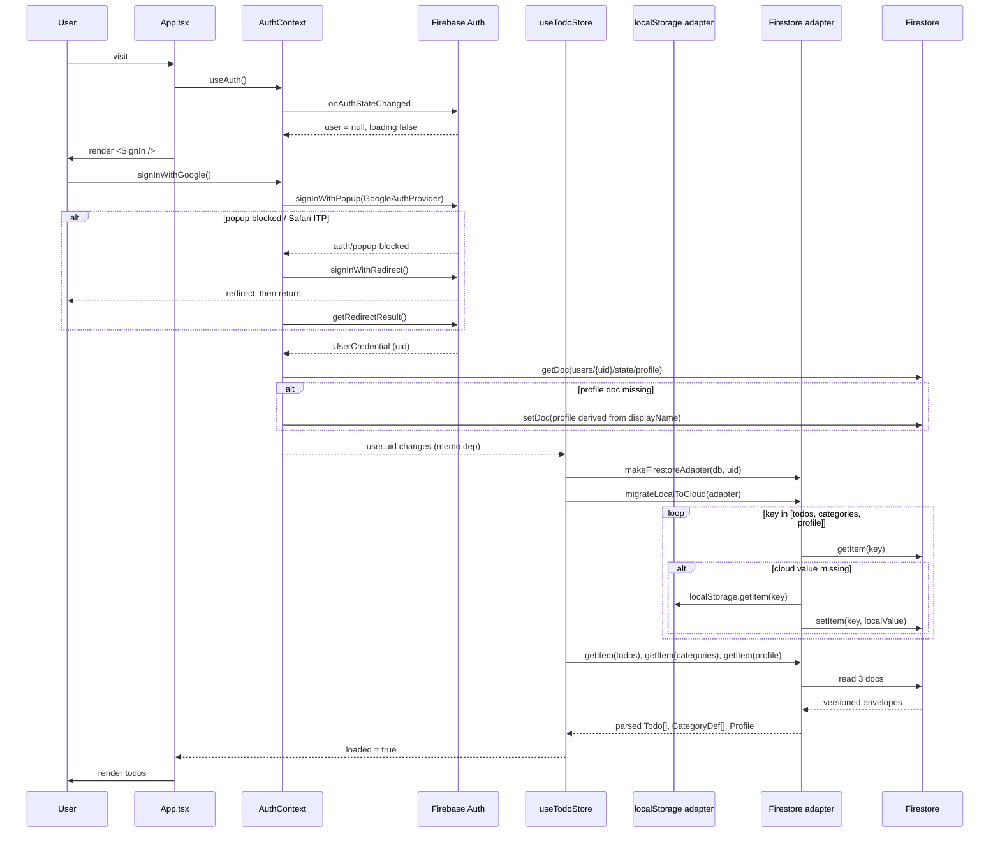
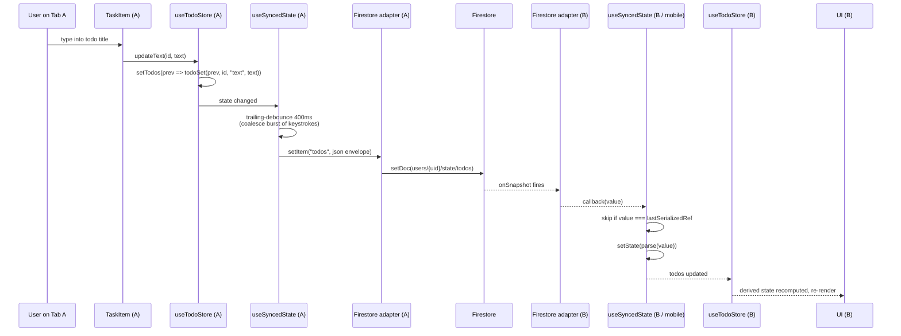

# Architecture & Workflow

Diagrams describing the cross-platform topology of `my-todo` and the runtime data flow for auth + sync. Mermaid renders inline on GitHub. A FigJam mirror lives at the link in the [FigJam mirror](#figjam-mirror) section at the bottom (kept loosely in sync — Mermaid here is the source of truth).

## 1. System architecture

How the three packages, Firebase, hosting, and the app-store pipelines fit together. The dashed boundary is the runtime adapter swap: `useTodoStore` picks `localStorage` / `AsyncStorage` when signed out, and `Firestore` once a `uid` is available.

### Notes on the architecture

- **`core/` is pure TS.** No React, no platform deps. Both apps import via relative paths (`'../../core/src/...'`). No path aliases, no monorepo tooling.
- **The adapter swap is the linchpin.** `useTodoStore` memoizes `adapter` on `uid` (NOT on the `User` reference — Firebase rotates it ~hourly on token refresh).
- **Per-key gated migration.** On first sign-in, `migrateLocalToCloud(adapter)` walks `["todos","categories","profile"]` and pushes each local value up only if the cloud value is missing. Per-key gating prevents stale local todos from clobbering cloud todos when a cloud-side profile happens to be absent.
- **Web persistent cache.** `initializeFirestore` is configured with `persistentLocalCache({ tabManager: persistentMultipleTabManager() })` — repeat loads paint instantly from IndexedDB; two open tabs share the same cache.
- **Security.** `firestore.rules` allows read/write on `users/{uid}/state/{key}` only when `request.auth.uid == uid`. Default-deny everywhere else (including the root `users` collection — listing it would otherwise leak the uid set). Verified by `web/tests/firestore-rules.test.ts` under the emulator.
- **Hosting.** AWS Amplify is the prod surface (`main.dhcuxhzauzw4c.amplifyapp.com`); Firebase Hosting is configured as a fallback target but isn't the canonical deploy.
- **iOS pipeline shipped.** Build 16 / v1.0 in App Store. Android pipeline is wired but Play Store submission is parked on Google's developer-account verification (real Android device required).

## 2. Auth + sync workflow

Two sequences. The first covers sign-in and the adapter swap; the second covers a mutation propagating from one tab to another (or web ↔ mobile).

### 2a. Sign-in → adapter swap → first-time migration

### 2b. Mutation → debounced write → cross-device fan-out

### Workflow notes

- **Debounce.** A burst of mutations (typing in a title) collapses into one `setDoc`. Without it every keystroke would be a write.
- **Round-trip guard.** `lastSerializedRef` in `useSyncedState` short-circuits the write→`onSnapshot`→`setState` round-trip — otherwise the writing tab would re-render itself from its own write.
- **Auth boundaries.** Apple sends `fullName` only on the **first** sign-in. The web flow handles this in `seedProfileIfMissing` (popup path inline, redirect path via `getRedirectResult`); mobile handles it in `signInWithApple` directly using `credential.fullName`.
- **Sign-out.** Clears `["todos","categories","profile"]` from local storage (web `localStorage`, mobile `AsyncStorage`) so the next user signing in on the same device can't bleed prior-user data into a fresh Firestore via `migrateLocalToCloud`.
- **Delete account.** Deletes the three Firestore state docs first (security rules block writes once auth is gone), then `deleteUser`. Throws `RecentLoginRequiredError` on `auth/requires-recent-login` so the UI can prompt re-auth.

## FigJam mirror

FigJam versions of these diagrams are published below — useful for stakeholder review or quick visual exploration. The Mermaid above is the source of truth; if the two diverge, trust the Mermaid and regenerate.

- [System architecture](https://www.figma.com/board/3i7eiMCySzF6tBIwa6s3bS) — mirrors §1
- [Sign-in workflow](https://www.figma.com/board/7swkuCLxDDWXWafwVvwvNB) — mirrors §2a
- [Sync workflow](https://www.figma.com/board/6SvvLRrqoPBcKc0A9RaByH) — mirrors §2b
